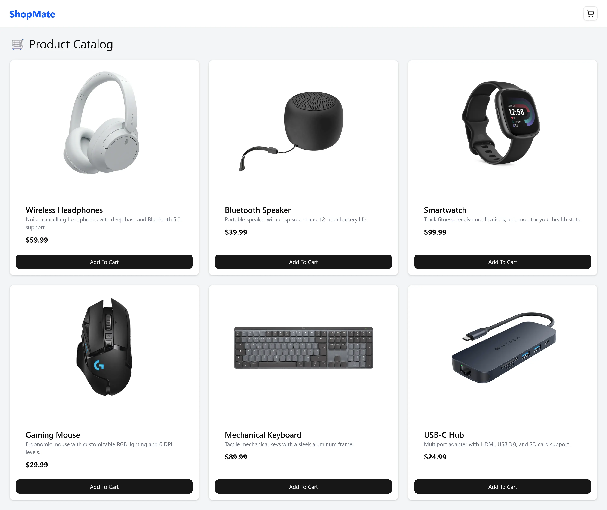
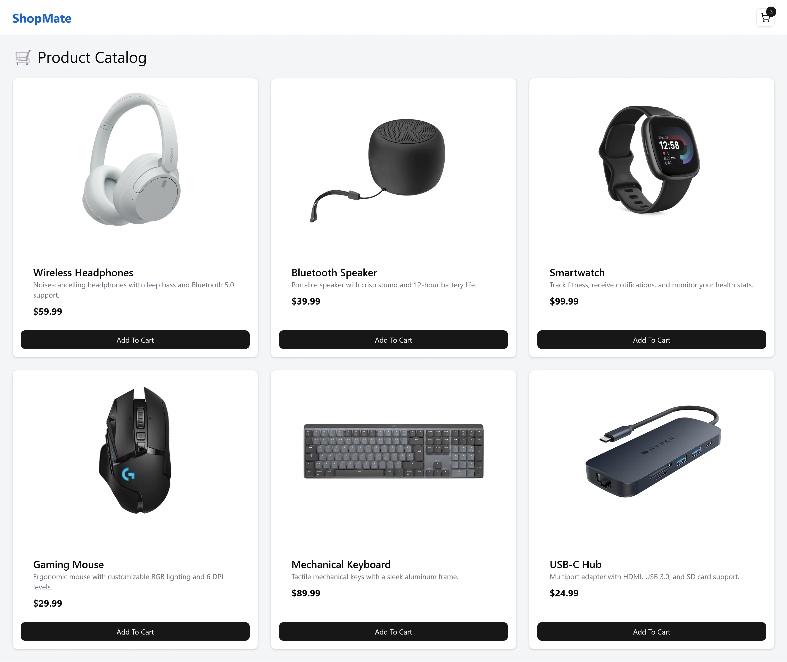
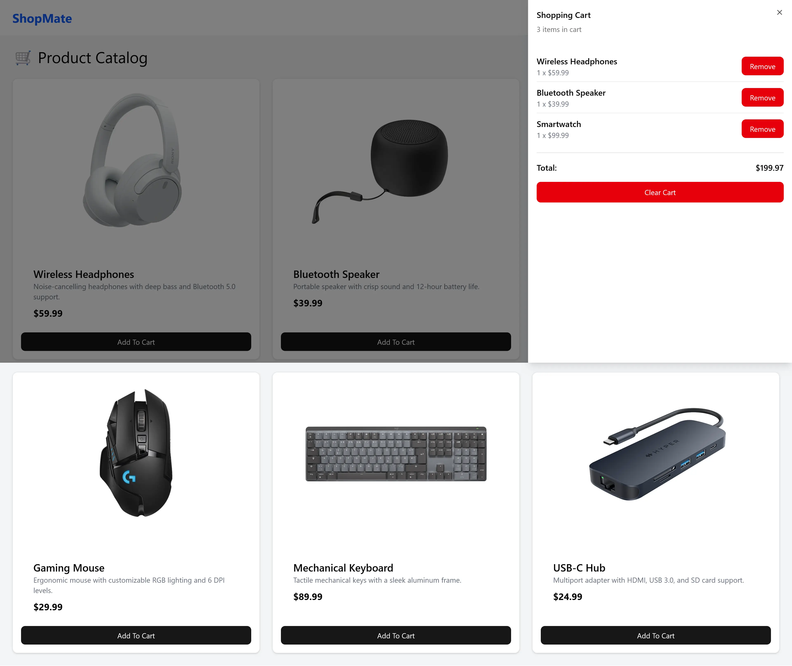

# 🛒 Shopping Cart UI — Modern React & TypeScript

A modern, fully typed shopping cart application built with React and TypeScript.
This project is a reimplementation of a course project from **“Modern React From the Beginning”**, rebuilt from scratch.

The focus of this project is learning and implementing React Context API with TypeScript.

## 📸 Screenshots / Demo





## 🔍 Project Overview

This application demonstrates how to build a real-world React UI using modern tools and best practices:

- Typed React components with **TypeScript**
- Component-driven UI using **shadcn/ui**
- Utility-first styling with **Tailwind CSS**
- Local mock REST API using **json-server**
- Fast development environment powered by **Vite**

The app simulates a small e-commerce experience, allowing users to browse products and manage a shopping cart.

## 🚀 Tech Stack

- **React**
- **TypeScript**
- **Vite**
- **Tailwind CSS**
- **shadcn/ui**
- **json-server**

## ✨ Features

- Fetch products from a mock REST API
- Add and remove items from the shopping cart
- Derived cart totals
- Fully responsive layout
- Reusable, accessible UI components
- Strongly typed API and component interfaces

## ⚙️ Getting Started

### Clone the repository

```bash
git clone https://github.com/hermanconnor/react-shopping-cart.git
cd react-shopping-cart
```

### Install dependencies

```bash
npm install
```

### Start the mock API

```bash
npm run server
```

### Run the development server

```bash
npm run dev
```

Open:

```
http://localhost:5173
```

## 🔌 Mock API

Powered by **json-server**, providing a simple REST interface.

All data is stored locally in:

```txt
data/db.json
```

## 🎯 What This Project Demonstrates

- React Context API with TypeScript
- Component composition and reuse
- API interaction and async state handling
- Clean UI implementation with Tailwind + shadcn

## 📜 License

MIT License
